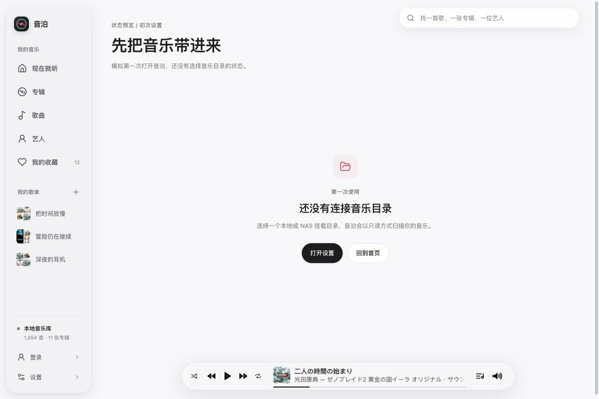
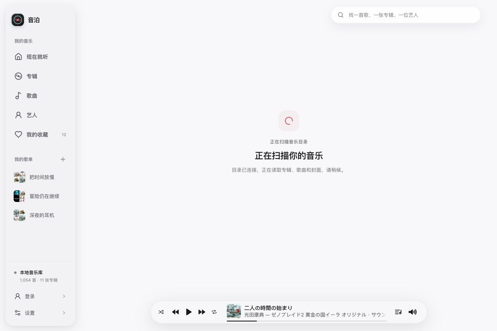
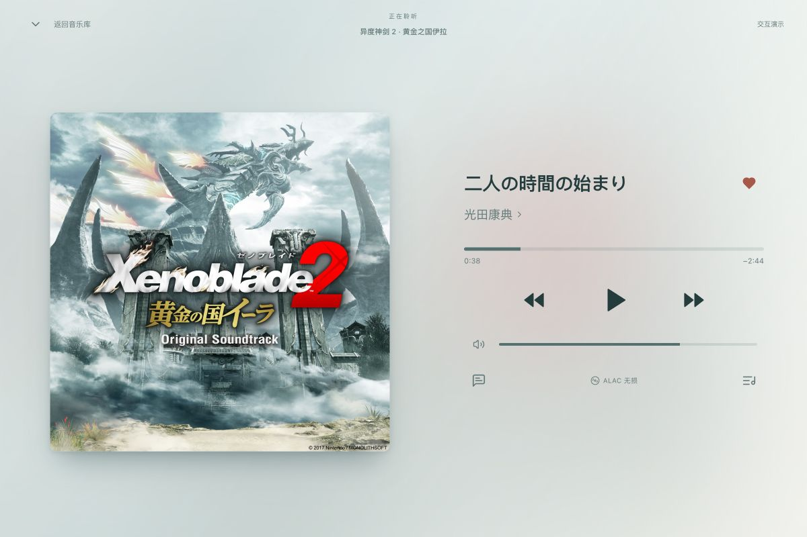
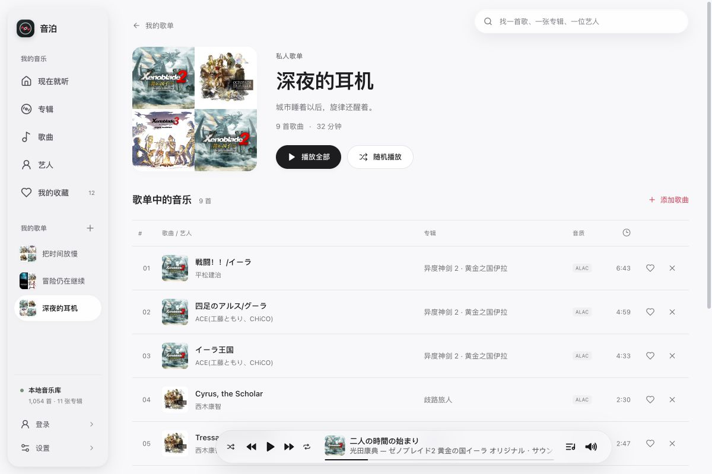
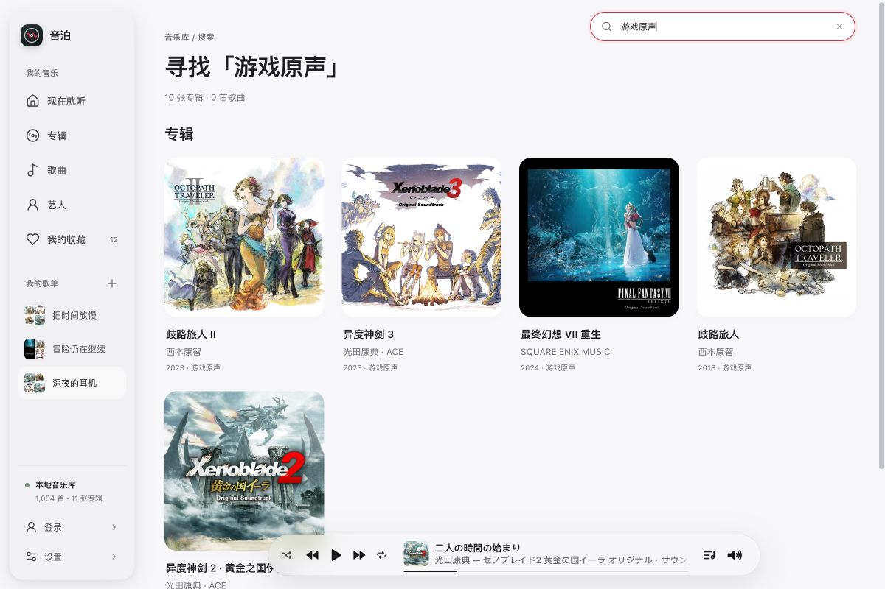
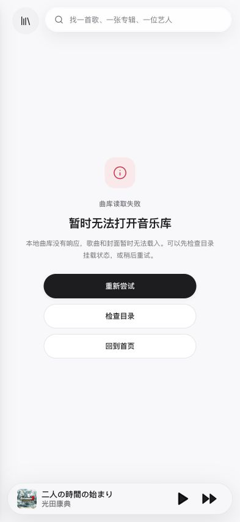

# 音泊原型：页面与状态覆盖审计

> 隐私说明：环境地址和路径已替换为示例；原始验收附件在仓库外私有保存，不随仓库发布。

审计日期：2026-09-27。代码基线：e87da5b。目标：检查当前交互原型是否遗漏必要的页面、弹窗或状态设计。

结论：主浏览页面和多数整页空态已经覆盖，仍有 7 组设计缺口。优先补齐登录会话、完整首次使用状态、扫描过程与播放器异常，再补歌单管理、完整搜索结果及资源缺省。多数缺口适合扩展现有页面或组件。

本次在独立的浏览器标签页中检查，保留 20 张本轮截图；主要检查尺寸为桌面 1200 × 800、移动端 393 × 852，另有初始窄窗口记录。已恢复临时调整的浏览器尺寸。检查结合实际交互、页面结构及原型代码；正式客户端的接口和状态只用于确认产品已有能力。

原型明确使用前端模拟登录、扫描和播放。本报告评估这些流程有没有对应的可预览设计；未接后端、没有真实音频输出和刷新后重置数据均属于既定原型边界。

## 1. 登录与会话 — 部分覆盖，P1

已有：动态背景、居中玻璃表单、密码显隐、空表单校验、连接中按钮、进入演示以及成功返回首页。

实际检查：提交空表单会显示提示；输入临时测试文本后进入首页，但侧栏仍显示“登录”。当前登录函数只模拟非空输入后的成功，没有可预览的凭据错误、服务连接失败、会话过期或退出状态。

需要补齐：登录失败与重试、已登录入口、退出后的落点、会话失效后的重新登录，以及登录完成后回到原访问位置或首次设置的分支。登录字段应与现有单用户密码登录方式保持一致。

无障碍观察：输入和密码显隐按钮已有可访问名称，错误信息使用 alert；错误信息尚未通过 aria-describedby 关联到输入，也没有输入错误标记。

证据：[登录页](03-login.jpg)、[登录成功后的首页](05-after-login.jpg)。代码：[登录模拟](../../../src/App.tsx#L75)、[成功跳转](../../../src/App.tsx#L688)、[现有登录/退出接口](../../../../../src/client/api.ts#L63)。

## 2. 首次使用与首页 — 局部空态已覆盖，整页状态不完整，P1

已有：初次设置引导、未选择目录的设置弹窗、曲库为空等预览页面，入口和下一步操作明确。

实际检查：初次设置页显示“还没有连接音乐目录”，但侧栏同时显示 1,054 首歌曲、11 张专辑、12 首收藏和三张歌单；底部仍出现一首可操作的歌曲。预览目前只替换主内容区域，没有呈现真正首次使用时整个应用的状态。

需要补齐：没有当前歌曲时的播放器状态；侧栏数量、导航、歌单区域与空曲库一致的状态；首次导入后尚无播放记录时“继续聆听”的替代内容。首页没有私人歌单时，当前只有空的卡片容器，也需要明确的新建引导或收起该区域。

无障碍观察：主要空态使用有名称的 region，操作按钮有文字；全局仍显示不适用于当前状态的播放控件，会让视觉和辅助技术用户都误解实际可用内容。

证据：[初始设置弹窗](07-settings-initial.jpg)。代码：[预置当前歌曲](../../../src/App.tsx#L179)、[首页区域](../../../src/App.tsx#L437)、[初次设置预览](../../../src/App.tsx#L649)。

## 3. 目录选择与扫描 — 起止和部分失败已覆盖，过程与结果分支不完整，P1

已有：目录选择、不可用目录禁选、选目录后自动扫描、扫描等待、完全成功、部分成功、失败文件详情、重试和更换目录。实际走通了“初次设置 → 选择 /music → 自动扫描 → 完成”。

需要补齐：

- 长时间扫描中的阶段、已检查文件数和正在处理的目录等反馈；可继续浏览时的全局扫描提示。
- 离开扫描页后，仍能查看本次进度和结果的入口。当前自动扫描演示仅在仍停留于 loading 路由时显示完成结果。
- 扫描完成但没有找到可播放文件的结果，说明空目录、格式未支持等可能原因，并提供更换目录的操作。
- 扫描启动失败、扫描中断的状态和恢复动作；它们应与“曲库读取失败”和“部分文件失败”有所区分。

目前的扫描等待页有转圈和说明文字，因此不是完全缺少“扫描中”页面；缺少的是足以支撑 NAS 长时间任务的过程信息和跨页面延续。

无障碍观察：部分成功页已有 status 和 busy 状态；普通扫描等待页使用的 StatePanel 没有传入 busy，默认 aria-busy 为 false，后续进度反馈还应提供适度的状态播报。

证据：[目录选择](08-directory-picker.jpg)、[扫描完成](10-scan-complete.jpg)、[部分失败](11-scan-partial.jpg)、[失败详情](12-scan-failures.jpg)。代码：[扫描流程](../../../src/App.tsx#L234)、[等待页面](../../../src/App.tsx#L601)、[正式扫描状态字段](../../../../../src/shared/types.ts#L88)。

下图为自动扫描结束后重新打开同一 loading 视图的截图，用于检查等待状态设计，不代表实际扫描仍在持续。

## 4. 播放器与歌词 — 常规和内容空态已覆盖，播放异常未覆盖，P1

已有：桌面/移动播放器、播放与暂停、进度与音量、队列编辑、空待播清单，以及无歌词状态。实际切换到了无歌词和空队列，移动端也有相应布局。

需要补齐：音频加载、缓冲、等待转码、NAS 连接中断、文件不可用、解码失败或浏览器阻止播放时的状态；应提供重试、切换歌曲、检查目录等与原因相符的恢复操作。胶囊播放器和沉浸播放页需表达一致。

歌词还需要“载入中”和“读取失败/重试”，避免把读取失败混同于原本没有歌词。

判断依据：两个原型播放器只有 playing 布尔状态，没有加载、缓冲、错误等状态参数。正式客户端已定义 loading、buffering、error 和不同播放失败原因；这些状态尚未有原型对应设计。

无障碍观察：播放、队列、歌词按钮和进度滑条已有可访问名称；新增等待与异常应使用适当的 status/alert，并保证恢复按钮在键盘和触控下可操作。本次未运行屏幕阅读器完整测试。

证据：[无歌词](18-no-lyrics.jpg)、[桌面空队列](19-queue-empty.jpg)、[移动端空队列](20-mobile-queue-empty.jpg)。代码：[沉浸播放器参数](../../../src/NowPlaying.tsx#L8)、[胶囊播放器参数](../../../src/CapsulePlayer.tsx#L6)、[正式播放异常状态](../../../../../src/client/async-state.ts#L29)。

## 5. 歌单与收藏 — 创建和增删歌曲已覆盖，歌单管理缺失，P2

已有：歌单集合、歌单详情、新建及名称非空校验、添加歌曲、防重复添加、移除歌曲、收藏切换，以及空歌单和空收藏。

实际检查：歌单详情只有播放、随机播放、添加歌曲和逐行移除，没有重命名、删除整张歌单或调整歌曲顺序的入口。原型也没有这些操作的弹窗与完成反馈。

需要补齐：重命名表单、删除歌单的确认和完成落点、排序编辑状态及保存反馈。正式接口已有 renamePlaylist、deletePlaylist、reorderPlaylist，因此属于现有产品能力的设计遗漏。

收藏、创建歌单、添加/移除歌曲目前立即成功，也需要可预览的保存中、保存失败、重试与必要的回退反馈；见第 7 项。

无障碍观察：歌曲收藏和移除操作已有包含歌名的可访问名称，新建表单有输入错误关联。新增排序需提供键盘可用的操作，不能只依赖拖拽。

代码：[歌单详情](../../../src/App.tsx#L519)、[歌单接口](../../../../../src/client/api.ts#L103)。

## 6. 搜索 — 候选和无结果已覆盖，完整结果不完整，P2

实际复现两项：

- 搜索“游戏原声”并按 Enter：标题显示 10 张专辑，实际只渲染 5 张，页面没有查看其余专辑的入口。
- 搜索“西木康智”：候选列表有艺人项，按 Enter 后完整结果页只有“专辑”和“歌曲”，没有艺人分区。

需要补齐：艺人完整结果、各类结果的查看更多/分页或增量加载，以及局部结果载入失败时的重试。现有歌曲列表的“加载更多”不能覆盖专辑结果被截断的问题。

已有优点：候选层保留原页面上下文，无匹配页面提供重新搜索与回首页；曲目、专辑有明确下一步操作。

无障碍观察：搜索框已有名称，Enter 能提交，空态按钮有文字；候选容器使用 listbox，但内部主要是普通按钮，键盘与语义完整性仍需专项验证，本次未作符合性结论。

证据：[艺人查询完整结果](15-search-artist.jpg)、[无匹配](16-search-empty.jpg)。代码：[候选与完整结果](../../../src/App.tsx#L568)、[完整结果截取](../../../src/App.tsx#L582)。

## 7. 局部异步状态与资源缺省 — 尚未形成可预览方案，P2

这组依据代码确认，没有伪造故障截图。本轮实际数据均有可读取封面，未触发真实网络/文件故障。

需要补齐：

- 封面不存在或加载失败时，专辑卡片、详情封面、艺人图和播放器使用一致的占位设计。当前 Cover 直接渲染图片，未提供失败回退；空歌单的拼图占位不能覆盖这些位置。
- 艺人、专辑、年份、时长等元数据缺失时的展示规则。正式类型允许这些字段为空，当前原型快照未提供缺失示例。
- 列表或详情局部加载中、加载失败、加载更多失败等状态，保留已加载内容并在对应区域重试。
- 收藏、歌单等写入操作的保存中/失败状态，避免只出现成功反馈。

已有优点：正常曲目和卡片的层级、封面尺寸与文字截断已有可复用布局；可以直接在这些组件上补状态。

无障碍观察：正常封面有替代文字；缺失资源仍需确保内容名称可读，异步结果变化应通过适当的状态区域反馈。颜色和对比度未做仪器测量。

代码：[封面组件](../../../src/App.tsx#L136)、[收藏与歌单操作](../../../src/App.tsx#L276)、[可缺失的正式元数据字段](../../../../../src/shared/types.ts#L23)。正常布局证据可见第 5、6 项截图。

## 8. 已有页面与异常覆盖清单 — 基础覆盖较完整

下表区分本轮实际页面抽查与代码核对，避免把已有状态重复列为缺失。

| 范围 | 已有页面/状态 | 本轮证据 |
| --- | --- | --- |
| 主浏览 | 首页、专辑集合/详情、歌曲列表、艺人集合/详情、收藏、歌单集合/详情、搜索、沉浸播放、登录 | 实际抽查首页、登录、歌单详情、搜索、播放器；其余核对路由与渲染分支 |
| 首次使用 | setup-empty、library-empty、albums-empty、artists-empty、playlists-empty | 实际检查 setup-empty 及初始设置；其余核对预览分支 |
| 列表空态 | 空收藏、空歌单、空歌单集合、格式筛选无歌曲、空专辑碟片、艺人无歌曲 | 代码分支已存在；本轮未逐一构造空数据集 |
| 搜索 | 候选、有结果、无匹配 | 实际查询“游戏原声”“西木康智”“zzzz-no-match” |
| 曲库异常 | loading、error、目录不可访问、扫描部分成功、扫描成功、失败文件详情、重试中的按钮状态 | 实际走通目录选择和自动扫描，打开部分成功/失败详情；移动端检查 error 与到目录异常的入口 |
| 内容失效 | 未知页面、失效专辑、失效艺人、失效歌单的 404 | 核对 renderNotFound 和路由；本轮未逐一导航验证 |
| 弹窗 | 设置、目录选择、新建歌单、添加到歌单、为歌单选歌、扫描失败详情、关于、待播清单 | 实际检查设置、目录选择、失败详情；其余核对分支 |
| 播放空态 | 无歌词、无后续待播歌曲 | 桌面实际切换；移动端复查空队列 |

现有整页异常设计已经提供原因和恢复入口。移动端的曲库读取失败页也有“重新尝试”“检查目录”“回到首页”，不需要再重复新增同义页面。

验证边界：本次为原型覆盖审计，没有接入真实认证、NAS 扫描、音频流或故障注入；没有做所有断点、两套主题、全部键盘路径和屏幕阅读器的完整回归。图片缺失和局部请求错误的结论来自组件状态核对。扫描等待截图为同一视图的稳定复看。尺寸调整期间的一张截图与缩放异常的全页截图已剔除，均不用于结论。

建议下一步先补齐 P1 的会话、整页首次使用、扫描过程和播放异常，并为每种状态提供稳定预览入口，再补齐 P2 的管理和结果完整性。
